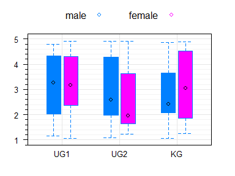
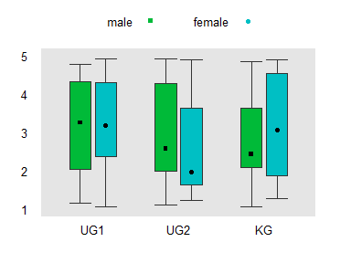
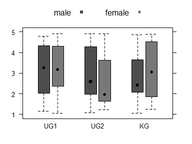

<!-- README.md is generated from README.Rmd. Please edit that file -->

# stp25output

Die Scripten dienen der Erstellung von Reports als HTML aber auch von
PDF ueber knit. Zum Teil handelt es sich um modifizerte Funktionen von
R2HTML, texreg und htmlTable.

## Overview

  - Initialisiert von neuen Projekten
      - `Projekt()` und `End()` Initialisiert ein neues Projekt und
        aufruf der HTML-Seite mit Hilfe von R2HTML.
      - `HTML_Start()` und `HTML_End()` Wie Projekt aber ohne den ganzen
        Überhau von R2HTML.
  - Text und Tabellen-Formatierung
      - `Output` Erstellt Tabellen
      - `Text`, `HTML_P` und `HTML_...` Schreibt HTML Text.
  - Hilfsfunktionen
      - `SaveDate` Speichert Bilder in den Arbeitsfolder.
      - `fix_irgendwas` Repariert Levels und Labels und Zahlen fuer die
        Ausgabe.
      - `set_my_options` und `get_my_options` Formatierungs-Optionen

## Output formats

| File | Type            | Parameter        | which\_output() |
| ---- | --------------- | ---------------- | --------------- |
| r    |                 |                  | text            |
| r    | Projekt(“html”) |                  | html            |
| r    | spin            | html\_document   | markdown\_html  |
| r    | spin            | pdf\_document    | latex           |
| r    | spin            | word\_document   | docx            |
| Rmd  |                 | html\_document   | markdown\_html  |
| Rmd  |                 | pdf\_document    | latex           |
| Rmd  |                 | word\_document   | docx            |
| Rmd  |                 | beamer           | latex           |
| Rmd  |                 | github\_document | markdown\_html  |

## Projekt

Initialisieren eines Projektes.

``` r
# devtools::install_github("stp4/stp25output")
get_my_options()$output
#> [1] ""
which_output()
#> [1] "markdown_html"
Projekt("md", "Beispiel Projekt",
        datum = date(),
        fig_folder = "Fig",
        html_folder = "Results",
        OutDec = NULL,
        contrasts =  c("contr.Treatment", "contr.poly")
        )
#> 
#> Kontraste von  contr.treatment, contr.poly auf
#>  contr.Treatment, contr.poly  umgestellt!
#> 
#> set: output = md
get_my_options()$output
#> [1] "md"
which_output()
#> [1] "markdown"

set_my_options(prozent=list(digits=c(1,0), style=2))
set_lattice_ggplot()
# Optionen format:  HTML, Spin, Knit, Rpres oder Text
APA2(.~ gruppe , hkarz, caption="Deskriptive Analyse")
#> 
#> 
#> |Item  |N  |krank (n=24) |gesund (n=21) |
#> |:-----|:--|:------------|:-------------|
#> |tzell |45 |63.85 (5.61) |71.27 (4.84)  |
#> |lai   |45 |0.12 (0.34)  |0.76 (0.44)   |

End()
#> Warning in HTMLGetFile(): not default HTML output file defined; please call
#> HTMLSetFile2() to set it
#> 
#> Reset Kontraste
```

### Usage

data.frame()

``` r
get_my_options()$output
```

\[1\] ""

``` r
which_output()
```

\[1\] “markdown\_html”

``` r
 
dat<- data.frame(
term = c("A", "B", "C", "D"),
n = c(23, 14, 56, 2),
m = c("4.7 (2.4)", "4.1 (2.3)", "8.9 (3.6)", NA)
) 

dat  %>% Output("data.frame()")
```

<table class="gmisc_table" style="border-collapse: collapse; padding-left: .5em; padding-right: .2em;">

<thead>

<tr>

<td colspan="3" style="text-align: left;">

Tab 1: data.frame()

</td>

</tr>

<tr>

<th style="border-bottom: 1px solid grey; border-top: 2px solid grey; text-align: center;">

Quelle

</th>

<th style="border-bottom: 1px solid grey; border-top: 2px solid grey; text-align: center;">

n

</th>

<th style="border-bottom: 1px solid grey; border-top: 2px solid grey; text-align: center;">

m

</th>

</tr>

</thead>

<tbody>

<tr>

<td style="padding-left: .5em; padding-right: .2em; text-align: left;">

A

</td>

<td style="padding-left: .5em; padding-right: .2em; text-align: left;">

23

</td>

<td style="padding-left: .5em; padding-right: .2em; text-align: left;">

4.7 (2.4)

</td>

</tr>

<tr>

<td style="padding-left: .5em; padding-right: .2em; text-align: left;">

B

</td>

<td style="padding-left: .5em; padding-right: .2em; text-align: left;">

14

</td>

<td style="padding-left: .5em; padding-right: .2em; text-align: left;">

4.1 (2.3)

</td>

</tr>

<tr>

<td style="padding-left: .5em; padding-right: .2em; text-align: left;">

C

</td>

<td style="padding-left: .5em; padding-right: .2em; text-align: left;">

56

</td>

<td style="padding-left: .5em; padding-right: .2em; text-align: left;">

8.9 (3.6)

</td>

</tr>

<tr>

<td style="padding-left: .5em; padding-right: .2em; border-bottom: 2px solid grey; text-align: left;">

D

</td>

<td style="padding-left: .5em; padding-right: .2em; border-bottom: 2px solid grey; text-align: left;">

2

</td>

<td style="padding-left: .5em; padding-right: .2em; border-bottom: 2px solid grey; text-align: left;">

</td>

</tr>

</tbody>

<tfoot>

<tr>

<td colspan="3">

</td>

</tr>

</tfoot>

</table>

``` r

matrix(c("a1","a2",3,4,5,6),
                nrow=2, byrow=TRUE,
                dimnames=list(gender=c("M", "F"),
                              party=c( "Dem", "Ind", "Rep")))  #%>% Output("matrix()")
```

``` 
  party
```

gender Dem Ind Rep M “a1” “a2” “3” F “4” “5” “6”

``` r

as.table(matrix(c("a1","a2",3,4,5,6),
                 nrow=2, byrow=TRUE,
                 dimnames=list(gender=c("M", "F"),
                               party=c( "Dem", "Ind", "Rep")))) %>% Output("as.table()")
```

<table class="gmisc_table" style="border-collapse: collapse; padding-left: .5em; padding-right: .2em;">

<thead>

<tr>

<td colspan="5" style="text-align: left;">

Tab 2: as.table()

</td>

</tr>

<tr>

<th colspan="1" style="font-weight: 900; border-top: 2px solid grey; text-align: center;">

</th>

<th style="border-top: 2px solid grey;; border-bottom: hidden;">

 

</th>

<th colspan="3" style="font-weight: 900; border-bottom: 1px solid grey; border-top: 2px solid grey; text-align: center;">

party

</th>

</tr>

<tr>

<th style="border-bottom: 1px solid grey; text-align: center;">

gender

</th>

<th style="border-bottom: 1px solid grey;" colspan="1">

 

</th>

<th style="border-bottom: 1px solid grey; text-align: center;">

Dem

</th>

<th style="border-bottom: 1px solid grey; text-align: center;">

Ind

</th>

<th style="border-bottom: 1px solid grey; text-align: center;">

Rep

</th>

</tr>

</thead>

<tbody>

<tr>

<td style="padding-left: .5em; padding-right: .2em; text-align: left;">

M

</td>

<td style colspan="1">

 

</td>

<td style="padding-left: .5em; padding-right: .2em; text-align: left;">

a1

</td>

<td style="padding-left: .5em; padding-right: .2em; text-align: left;">

a2

</td>

<td style="padding-left: .5em; padding-right: .2em; text-align: left;">

3

</td>

</tr>

<tr>

<td style="padding-left: .5em; padding-right: .2em; border-bottom: 2px solid grey; text-align: left;">

F

</td>

<td style="border-bottom: 2px solid grey;" colspan="1">

 

</td>

<td style="padding-left: .5em; padding-right: .2em; border-bottom: 2px solid grey; text-align: left;">

4

</td>

<td style="padding-left: .5em; padding-right: .2em; border-bottom: 2px solid grey; text-align: left;">

5

</td>

<td style="padding-left: .5em; padding-right: .2em; border-bottom: 2px solid grey; text-align: left;">

6

</td>

</tr>

</tbody>

<tfoot>

<tr>

<td colspan="5">

</td>

</tr>

</tfoot>

</table>

``` r
 
Tabelle2(hkarz,  tzell, lai, gruppe, APA=TRUE )
```

<table class="gmisc_table" style="border-collapse: collapse; padding-left: .5em; padding-right: .2em;">

<thead>

<tr>

<td colspan="3" style="text-align: left;">

Tab 3: Charakteristik

</td>

</tr>

<tr>

<th style="border-bottom: 1px solid grey; border-top: 2px solid grey; text-align: center;">

Item

</th>

<th style="border-bottom: 1px solid grey; border-top: 2px solid grey; text-align: center;">

n

</th>

<th style="border-bottom: 1px solid grey; border-top: 2px solid grey; text-align: center;">

m

</th>

</tr>

</thead>

<tbody>

<tr>

<td style="padding-left: .5em; padding-right: .2em; text-align: left;">

tzell (mean)

</td>

<td style="padding-left: .5em; padding-right: .2em; text-align: left;">

45

</td>

<td style="padding-left: .5em; padding-right: .2em; text-align: left;">

67.31 (6.41)

</td>

</tr>

<tr>

<td style="padding-left: .5em; padding-right: .2em; text-align: left;">

lai (mean)

</td>

<td style="padding-left: .5em; padding-right: .2em; text-align: left;">

45

</td>

<td style="padding-left: .5em; padding-right: .2em; text-align: left;">

0.42 (0.50)

</td>

</tr>

<tr>

<td style="padding-left: .5em; padding-right: .2em; text-align: left;">

gruppe 

</td>

<td style="padding-left: .5em; padding-right: .2em; text-align: left;">

45

</td>

<td style="padding-left: .5em; padding-right: .2em; text-align: left;">

</td>

</tr>

<tr>

<td style="padding-left: .5em; padding-right: .2em; text-align: left;">

 krank

</td>

<td style="padding-left: .5em; padding-right: .2em; text-align: left;">

</td>

<td style="padding-left: .5em; padding-right: .2em; text-align: left;">

53% (24)

</td>

</tr>

<tr>

<td style="padding-left: .5em; padding-right: .2em; border-bottom: 2px solid grey; text-align: left;">

 gesund

</td>

<td style="padding-left: .5em; padding-right: .2em; border-bottom: 2px solid grey; text-align: left;">

</td>

<td style="padding-left: .5em; padding-right: .2em; border-bottom: 2px solid grey; text-align: left;">

47% (21)

</td>

</tr>

</tbody>

<tfoot>

<tr>

<td colspan="3">

</td>

</tr>

</tfoot>

</table>

``` r
res<-  Tabelle(hkarz,  tzell, lai, gruppe, APA=TRUE)
Output(res, add_row =c("<b>Erste Zeile</b>" = 1, "Dritte Zeile" = 3) )
```

<table class="gmisc_table" style="border-collapse: collapse; padding-left: .5em; padding-right: .2em;">

<thead>

<tr>

<td colspan="3" style="text-align: left;">

Tab 4: Charakteristik

</td>

</tr>

<tr>

<th style="border-bottom: 1px solid grey; border-top: 2px solid grey; text-align: center;">

Item

</th>

<th style="border-bottom: 1px solid grey; border-top: 2px solid grey; text-align: center;">

n

</th>

<th style="border-bottom: 1px solid grey; border-top: 2px solid grey; text-align: center;">

m

</th>

</tr>

</thead>

<tbody>

<tr>

<td style="padding-left: .5em; padding-right: .2em; text-align: left;">

<b>Erste Zeile</b>

</td>

<td style="padding-left: .5em; padding-right: .2em; text-align: left;">

</td>

<td style="padding-left: .5em; padding-right: .2em; text-align: left;">

</td>

</tr>

<tr>

<td style="padding-left: .5em; padding-right: .2em; text-align: left;">

tzell (mean)

</td>

<td style="padding-left: .5em; padding-right: .2em; text-align: left;">

45

</td>

<td style="padding-left: .5em; padding-right: .2em; text-align: left;">

67.31 (6.41)

</td>

</tr>

<tr>

<td style="padding-left: .5em; padding-right: .2em; text-align: left;">

lai (mean)

</td>

<td style="padding-left: .5em; padding-right: .2em; text-align: left;">

45

</td>

<td style="padding-left: .5em; padding-right: .2em; text-align: left;">

0.42 (0.50)

</td>

</tr>

<tr>

<td style="padding-left: .5em; padding-right: .2em; text-align: left;">

Dritte Zeile

</td>

<td style="padding-left: .5em; padding-right: .2em; text-align: left;">

</td>

<td style="padding-left: .5em; padding-right: .2em; text-align: left;">

</td>

</tr>

<tr>

<td style="padding-left: .5em; padding-right: .2em; text-align: left;">

gruppe 

</td>

<td style="padding-left: .5em; padding-right: .2em; text-align: left;">

45

</td>

<td style="padding-left: .5em; padding-right: .2em; text-align: left;">

</td>

</tr>

<tr>

<td style="padding-left: .5em; padding-right: .2em; text-align: left;">

 krank

</td>

<td style="padding-left: .5em; padding-right: .2em; text-align: left;">

</td>

<td style="padding-left: .5em; padding-right: .2em; text-align: left;">

53% (24)

</td>

</tr>

<tr>

<td style="padding-left: .5em; padding-right: .2em; border-bottom: 2px solid grey; text-align: left;">

 gesund

</td>

<td style="padding-left: .5em; padding-right: .2em; border-bottom: 2px solid grey; text-align: left;">

</td>

<td style="padding-left: .5em; padding-right: .2em; border-bottom: 2px solid grey; text-align: left;">

47% (21)

</td>

</tr>

</tbody>

<tfoot>

<tr>

<td colspan="3">

</td>

</tr>

</tfoot>

</table>

``` r
get_my_options()$output
#> [1] ""
which_output()
#> [1] "markdown_html"
```

``` r
#+ 
df1 %>% Output()
#> <table class='gmisc_table' style='border-collapse: collapse; padding-left: .5em; padding-right: .2em;' >
#> <thead>
#> <tr><td colspan='3' style='text-align: left;'>
#> Tab 5: </td></tr>
#> <tr>
#> <th style='border-bottom: 1px solid grey; border-top: 2px solid grey; text-align: center;'>Quelle</th>
#> <th style='border-bottom: 1px solid grey; border-top: 2px solid grey; text-align: center;'>n</th>
#> <th style='border-bottom: 1px solid grey; border-top: 2px solid grey; text-align: center;'>m</th>
#> </tr>
#> </thead>
#> <tbody>
#> <tr>
#> <td style='padding-left: .5em; padding-right: .2em; text-align: left;'>A</td>
#> <td style='padding-left: .5em; padding-right: .2em; text-align: left;'>23</td>
#> <td style='padding-left: .5em; padding-right: .2em; text-align: left;'>4.7 (2.4)</td>
#> </tr>
#> <tr>
#> <td style='padding-left: .5em; padding-right: .2em; text-align: left;'>B</td>
#> <td style='padding-left: .5em; padding-right: .2em; text-align: left;'>14</td>
#> <td style='padding-left: .5em; padding-right: .2em; text-align: left;'>4.1 (2.3)</td>
#> </tr>
#> <tr>
#> <td style='padding-left: .5em; padding-right: .2em; text-align: left;'>C</td>
#> <td style='padding-left: .5em; padding-right: .2em; text-align: left;'>56</td>
#> <td style='padding-left: .5em; padding-right: .2em; text-align: left;'>8.9 (3.6)</td>
#> </tr>
#> <tr>
#> <td style='padding-left: .5em; padding-right: .2em; border-bottom: 2px solid grey; text-align: left;'>D</td>
#> <td style='padding-left: .5em; padding-right: .2em; border-bottom: 2px solid grey; text-align: left;'>2</td>
#> <td style='padding-left: .5em; padding-right: .2em; border-bottom: 2px solid grey; text-align: left;'></td>
#> </tr>
#> </tbody>
#> <tfoot><tr><td colspan='3'>
#> </td></tr></tfoot>
#> </table>


df1 %>% Output(output=TRUE)
#> 
#>  Tab 6:  
#>   Quelle  n         m
#> 1      A 23 4.7 (2.4)
#> 2      B 14 4.1 (2.3)
#> 3      C 56 8.9 (3.6)
#> 4      D  2      <NA>
#> 
#> 

df1 %>% Output(output=FALSE)
#> NULL
```

``` r

df1 %>% Output()
```

<table class="gmisc_table" style="border-collapse: collapse; padding-left: .5em; padding-right: .2em;">

<thead>

<tr>

<td colspan="3" style="text-align: left;">

Tab 7:

</td>

</tr>

<tr>

<th style="border-bottom: 1px solid grey; border-top: 2px solid grey; text-align: center;">

Quelle

</th>

<th style="border-bottom: 1px solid grey; border-top: 2px solid grey; text-align: center;">

n

</th>

<th style="border-bottom: 1px solid grey; border-top: 2px solid grey; text-align: center;">

m

</th>

</tr>

</thead>

<tbody>

<tr>

<td style="padding-left: .5em; padding-right: .2em; text-align: left;">

A

</td>

<td style="padding-left: .5em; padding-right: .2em; text-align: left;">

23

</td>

<td style="padding-left: .5em; padding-right: .2em; text-align: left;">

4.7 (2.4)

</td>

</tr>

<tr>

<td style="padding-left: .5em; padding-right: .2em; text-align: left;">

B

</td>

<td style="padding-left: .5em; padding-right: .2em; text-align: left;">

14

</td>

<td style="padding-left: .5em; padding-right: .2em; text-align: left;">

4.1 (2.3)

</td>

</tr>

<tr>

<td style="padding-left: .5em; padding-right: .2em; text-align: left;">

C

</td>

<td style="padding-left: .5em; padding-right: .2em; text-align: left;">

56

</td>

<td style="padding-left: .5em; padding-right: .2em; text-align: left;">

8.9 (3.6)

</td>

</tr>

<tr>

<td style="padding-left: .5em; padding-right: .2em; border-bottom: 2px solid grey; text-align: left;">

D

</td>

<td style="padding-left: .5em; padding-right: .2em; border-bottom: 2px solid grey; text-align: left;">

2

</td>

<td style="padding-left: .5em; padding-right: .2em; border-bottom: 2px solid grey; text-align: left;">

</td>

</tr>

</tbody>

<tfoot>

<tr>

<td colspan="3">

</td>

</tr>

</tfoot>

</table>

``` r

df1 %>% Output(output="text")
#> 
#>  Tab 8:  
#>   Quelle  n         m
#> 1      A 23 4.7 (2.4)
#> 2      B 14 4.1 (2.3)
#> 3      C 56 8.9 (3.6)
#> 4      D  2      <NA>
#> 
#> 
```

``` r

df1 %>% Output(output="markdown")
```

| Quelle |  n | m         |
| :----- | -: | :-------- |
| A      | 23 | 4.7 (2.4) |
| B      | 14 | 4.1 (2.3) |
| C      | 56 | 8.9 (3.6) |
| D      |  2 |           |

## xtable()

Ist eine Package zum Erstellen von HTML und latex. Convert an R object
to an xtable object, which can then be printed as a LaTeX or HTML table

``` r
 
require(xtable)
#> Loading required package: xtable
data(tli)
## Demonstrate aov
fm1 <- aov(tlimth ~ sex + ethnicty + grade + disadvg, data = tli)
fm1.table <- xtable(fm1)

Output(fm1.table)
```

<table class="gmisc_table" style="border-collapse: collapse; padding-left: .5em; padding-right: .2em;">

<thead>

<tr>

<td colspan="6" style="text-align: left;">

Tab 9: Analysis of Variance Table Response: tlimth

</td>

</tr>

<tr>

<th style="border-bottom: 1px solid grey; border-top: 2px solid grey; text-align: center;">

Quelle

</th>

<th style="border-bottom: 1px solid grey; border-top: 2px solid grey; text-align: center;">

Df

</th>

<th style="border-bottom: 1px solid grey; border-top: 2px solid grey; text-align: center;">

Sum Sq

</th>

<th style="border-bottom: 1px solid grey; border-top: 2px solid grey; text-align: center;">

Mean Sq

</th>

<th style="border-bottom: 1px solid grey; border-top: 2px solid grey; text-align: center;">

F

</th>

<th style="border-bottom: 1px solid grey; border-top: 2px solid grey; text-align: center;">

Pr(\>F)

</th>

</tr>

</thead>

<tbody>

<tr>

<td style="padding-left: .5em; padding-right: .2em; text-align: left;">

sex

</td>

<td style="padding-left: .5em; padding-right: .2em; text-align: left;">

1

</td>

<td style="padding-left: .5em; padding-right: .2em; text-align: left;">

75.37

</td>

<td style="padding-left: .5em; padding-right: .2em; text-align: left;">

75.37

</td>

<td style="padding-left: .5em; padding-right: .2em; text-align: left;">

0.38

</td>

<td style="padding-left: .5em; padding-right: .2em; text-align: left;">

0.5417

</td>

</tr>

<tr>

<td style="padding-left: .5em; padding-right: .2em; text-align: left;">

ethnicty

</td>

<td style="padding-left: .5em; padding-right: .2em; text-align: left;">

3

</td>

<td style="padding-left: .5em; padding-right: .2em; text-align: left;">

2572.15

</td>

<td style="padding-left: .5em; padding-right: .2em; text-align: left;">

857.38

</td>

<td style="padding-left: .5em; padding-right: .2em; text-align: left;">

4.27

</td>

<td style="padding-left: .5em; padding-right: .2em; text-align: left;">

0.0072

</td>

</tr>

<tr>

<td style="padding-left: .5em; padding-right: .2em; text-align: left;">

grade

</td>

<td style="padding-left: .5em; padding-right: .2em; text-align: left;">

1

</td>

<td style="padding-left: .5em; padding-right: .2em; text-align: left;">

36.31

</td>

<td style="padding-left: .5em; padding-right: .2em; text-align: left;">

36.31

</td>

<td style="padding-left: .5em; padding-right: .2em; text-align: left;">

0.18

</td>

<td style="padding-left: .5em; padding-right: .2em; text-align: left;">

0.6717

</td>

</tr>

<tr>

<td style="padding-left: .5em; padding-right: .2em; text-align: left;">

disadvg

</td>

<td style="padding-left: .5em; padding-right: .2em; text-align: left;">

1

</td>

<td style="padding-left: .5em; padding-right: .2em; text-align: left;">

59.30

</td>

<td style="padding-left: .5em; padding-right: .2em; text-align: left;">

59.30

</td>

<td style="padding-left: .5em; padding-right: .2em; text-align: left;">

0.30

</td>

<td style="padding-left: .5em; padding-right: .2em; text-align: left;">

0.5882

</td>

</tr>

<tr>

<td style="padding-left: .5em; padding-right: .2em; border-bottom: 2px solid grey; text-align: left;">

Residuals

</td>

<td style="padding-left: .5em; padding-right: .2em; border-bottom: 2px solid grey; text-align: left;">

93

</td>

<td style="padding-left: .5em; padding-right: .2em; border-bottom: 2px solid grey; text-align: left;">

18682.87

</td>

<td style="padding-left: .5em; padding-right: .2em; border-bottom: 2px solid grey; text-align: left;">

200.89

</td>

<td style="padding-left: .5em; padding-right: .2em; border-bottom: 2px solid grey; text-align: left;">

</td>

<td style="padding-left: .5em; padding-right: .2em; border-bottom: 2px solid grey; text-align: left;">

</td>

</tr>

</tbody>

<tfoot>

<tr>

<td colspan="6">

</td>

</tr>

</tfoot>

</table>

``` r

fm2 <- lm(tlimth ~ sex*ethnicty, data = tli)
fm2b <- lm(tlimth ~ ethnicty, data = tli)

#Output(xtable(anova(fm2b, fm2)), output="md")
```

## knitr::kable

``` r
knitr::kable(
  df1, row.names = FALSE,
  format = "pandoc" 
)
```

| term |  n | m         |
| :--- | -: | :-------- |
| A    | 23 | 4.7 (2.4) |
| B    | 14 | 4.1 (2.3) |
| C    | 56 | 8.9 (3.6) |
| D    |  2 | NA        |

``` r

knitr::kable(
  df1, row.names = FALSE,
  format = "markdown" 
)
```

| term |  n | m         |
| :--- | -: | :-------- |
| A    | 23 | 4.7 (2.4) |
| B    | 14 | 4.1 (2.3) |
| C    | 56 | 8.9 (3.6) |
| D    |  2 | NA        |

``` r
knitr::kable(
  df1, row.names = FALSE,
  format = "pandoc" 
)
```

| term |  n | m         |
| :--- | -: | :-------- |
| A    | 23 | 4.7 (2.4) |
| B    | 14 | 4.1 (2.3) |
| C    | 56 | 8.9 (3.6) |
| D    |  2 | NA        |

## Grafik settings

``` r
require(stpvers)
set.seed(2)
n <- 20 * 3 * 2
DF <- data.frame(
  n = runif(n, min = 1, max = 5),
  e = runif(n, min = 1, max = 5),
  o = runif(n, min = 1, max = 5),
  g = runif(n, min = 1, max = 5),
  a = runif(n, min = 1, max = 5),
  treatment = gl(3, n / 3, labels = c("UG1", "UG2", "KG"))[sample.int(n)],
  sex = gl(2, n / 2, labels = c("male", "female"))
)
```

``` r
set_lattice()
bwplot2(e ~ treatment,
        DF,
        groups = sex,
        auto.key = list(columns = 2))
```

<!-- -->

``` r

set_lattice_ggplot()
bwplot2(e ~ treatment,
        DF,
        groups = sex,
        auto.key = list(columns = 2))
```

<!-- -->

``` r
set_lattice_bw()
bwplot2(e ~ treatment,
        DF,
        groups = sex,
        auto.key = list(columns = 2))
```

<!-- -->

``` r


reset_lattice()
```
